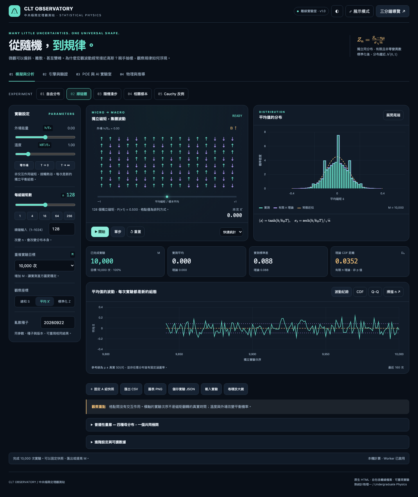

# CLT Observatory｜中央極限定理觀測站

物理系大三「熱統計物理一」互動模擬。從任意母分布出發，追蹤獨立抽樣如何形成宏觀分布，並連結順磁體、隨機漫步、相關性與重尾反例。

## 交作業只需要一個檔案

**下載 [`index.html`](index.html)，直接用瀏覽器開啟。提交作業時只交這個 HTML 即可。**

- 不需要安裝、建置、伺服器或帳號。
- 可直接以 `file://` 開啟；第一次開啟也可完全斷網。
- JavaScript、CSS、Chart.js、KaTeX、數學字型與圖示均包含在 HTML 內。
- 不會上傳實驗資料；AI 功能是產生可複製的探究提示詞。
- 請下載 GitHub 的原始檔案，而不是將 GitHub 原始碼預覽頁另存為 HTML。

其他資料夾是說明與開發驗證資料，執行時不會被 `index.html` 引用。



## 快速體驗

1. 開啟 `index.html`，按 **單步**，追蹤一次抽樣。
2. 按 **開始**，累積每次含有 `n` 個樣本的 `M` 次獨立實驗。
3. 改變 `n = 1 → 4 → 16 → 64 → 256`，比較有限 n 理論與常態近似。
4. 切換 **總和／平均／標準化**，區分位置、寬度與分布形狀。
5. 切到 **順磁體**，調整外場與溫度，觀察磁化波動。
6. 使用右上角 **三分鐘導覽**，依序探索主題；到 POE 頁記錄結論。

增加 **n** 會改變每次實驗結果的分布；增加 **M** 主要降低直方圖的取樣雜訊。

## 五種實驗情境

| 情境 | 模型與可觀察現象 |
|---|---|
| 自由分布 | 偏態、均勻、雙峰、三角、雙態、高斯、指數、手繪、確定值 |
| 順磁體 | 非交互作用雙態磁矩，Boltzmann 權重、磁化與熱波動 |
| 隨機漫步 | 獨立左右步進，路徑、終點分布與擴散尺度 |
| 相關樣本 | 每 g 個樣本共用一個結果，獨立群組數為 n/g |
| Cauchy 反例 | 樣本平均仍具 Cauchy 分布；有限變異數 CLT 不適用 |

## 功能

- 四分頁：模擬與分析、引擎與驗證、POE 與 AI、物理與推導。
- Canvas 微觀動畫；Chart.js 分布、波動紀錄、CDF、Q–Q 與 n 掃描。
- 有限分布 FFT 卷積、二項分布／高斯／Gamma 解析對照。
- 可重現種子、播放／暫停／單步／重置。
- A 組快照疊圖、四分布普適性畫廊、兩骰卷積放大鏡。
- 物理極限預設、六項頁面內數值自檢。
- 實測 CSV、圖表 PNG、實驗 JSON 儲存／載入、POE 紀錄與列印。
- 暗／亮主題、展示模式、響應式版面、鍵盤分頁與減少動態效果。

## 實驗儲存與重現

頁面不依賴瀏覽器 localStorage。**關閉前使用「儲存實驗 JSON」保存數據與筆記。**

JSON 包含版本、參數、全部實測總和、PRNG 狀態、目前可見抽樣快照、A 組及 POE 筆記。載入同版本檔案後可繼續原亂數序列。CSV 包含每次總和、平均與依真實變異數標準化的 Z；Cauchy／零變異數的 Z 留空。

動畫速度、主題與繪圖不消耗科學取樣亂數。比較可重現性時，需使用相同版本、參數、種子與抽樣次數；不同瀏覽器浮點計算仍可能在末位產生差異。

## 科學上的界線

- CLT 是標準化分布的極限結果，有限 n 通常只近似高斯；沒有通用的 `n ≥ 30` 保證。
- 順磁體動畫是平衡組態獨立重抽樣，不是含耦合自旋的 Ising 動力學，也不是實際磁矩翻轉時間。
- 手繪等有限曲線被離散化；FFT 對應此離散模型，並非原連續分布的無誤差解。
- 相關模式使用實際 `Var(S)=ngσ²` 標準化。金線額外呈現全部獨立的預測；CDF 距離使用真實變異數。
- Cauchy 不顯示不存在的理論平均／變異數，改用中位數與 IQR。畫面裁切不刪除尾端樣本。
- `μ ± SD(X̄)` 是一個標準差範圍，不宣稱任意分布都有固定涵蓋率。
- `Dₙ` 是有限 n 理論與配對高斯的 CDF 距離，不是顯著性檢定 p 值。Gamma 模式的 Dₙ 是網格估計。

詳見 [物理模型](docs/physics-models.md) 與 [數值方法](docs/numerical-methods.md)。

## 為什麼沒有 CDN／Euler／Verlet？

採用助教要求的原生單檔架構、四分頁、Canvas、集中狀態、POE 與物理合理性檢驗。為確保第一次離線開啟也能使用，提交版將第三方資源內嵌，樣式使用原生 CSS，而非依賴 Tailwind CDN。

CLT、系綜取樣與離散隨機漫步的合適算法是抽樣與卷積，不需要常微分方程積分器。這是對通用模擬器 prompt 的明確物理適配；不宣稱逐字滿足「必須 CDN」與「必須 Euler／Verlet」兩條。

## 檔案結構與維護

```text
index.html                  唯一提交／執行檔；也包含可讀的應用程式原始碼
README.md                   使用與交付說明
docs/physics-models.md       模型、公式與假設
docs/numerical-methods.md    抽樣、卷積、誤差與效能
docs/rubric-mapping.md       評分對照
docs/demo-script.md          三分鐘展示流程
docs/validation.md          已實測範圍與限制
docs/third-party-notices.md  第三方版本、授權與來源
tests/numerical.cjs          無依賴數值／封裝測試
tests/browser.cjs            開發用離線瀏覽器驗證
tests/boundaries.cjs         上限、回復與備援測試
```

應用程式區段在 `index.html` 內以 `observatory-styles`、`clt-math`、`clt-app` 標識。數值核心與 DOM 分離；測試直接讀取提交 HTML 的數值核心，避免另測一份可能不同步的實作。修改後直接保存 HTML 即可，沒有建置步驟。

## 開發驗證（使用 demo 不需要執行）

Node.js 20+ 的數值與封裝測試，不需安裝套件：

```sh
node tests/numerical.cjs
```

完整操作測試需另外準備 Playwright 及 Chromium／WebKit：

```sh
node tests/browser.cjs
node tests/boundaries.cjs
```

若 Playwright 不在預設模組搜尋路徑，可設定 `PLAYWRIGHT_MODULE` 為該套件路徑。`CLT_TEST_OUTPUT` 可指定測試輸出目錄；`CLT_BROWSERS=chromium` 或 `webkit` 可單獨測一個引擎。macOS 14 的 WebKit 2251 請使用 Playwright 1.59.1；較新的內建驅動可能發出此舊引擎不支援的 PushAPIEnabled 指令。測試以 `file://` 載入 HTML，不啟動伺服器。Chromium 使用離線旗標；WebKit 封鎖全部 HTTP(S)，避開其驅動在離線旗標下無法導覽本機檔案的限制。兩者皆確認沒有外部資源請求。

已驗證結果與未覆蓋平台請見 [驗證紀錄](docs/validation.md)。

## 致謝與來源

- [GGDoggy/CLT_demo](https://github.com/GGDoggy/CLT_demo)：助教獨立自旋、卷積與特徵函數教材，參考版本 `4ad1834d567ca5936bb303abb5b704e9a8dd3030`。本專案的應用程式為獨立實作。
- Chart.js **4.5.1**，MIT license。
- KaTeX **0.16.22**（含 auto-render、CSS、20 個 WOFF2 字型），MIT license。

第三方完整授權保留於 HTML 頂端與 [來源說明](docs/third-party-notices.md)。延伸物理教材列在模擬器的「物理與推導」分頁。
